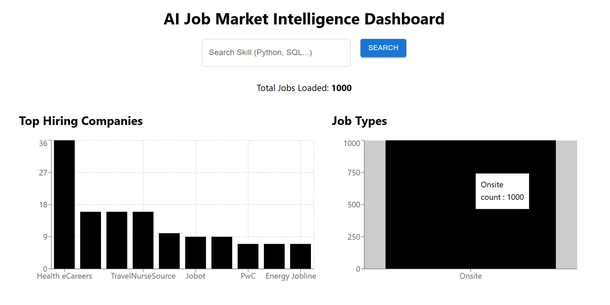
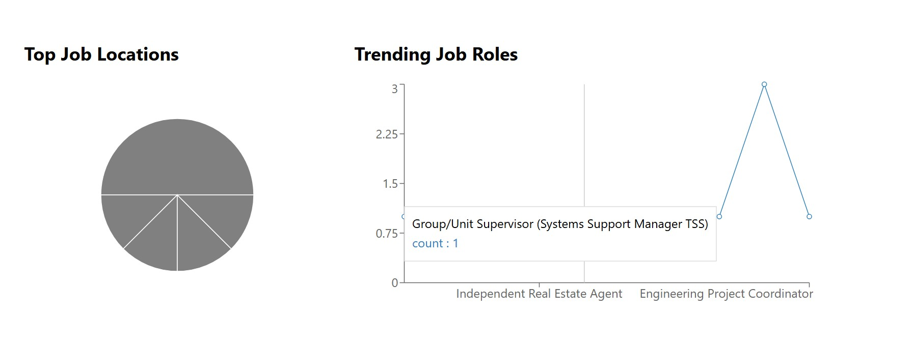
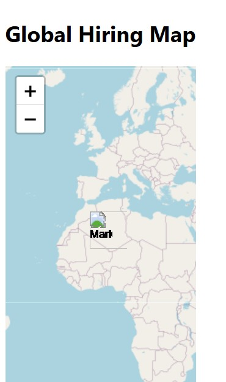
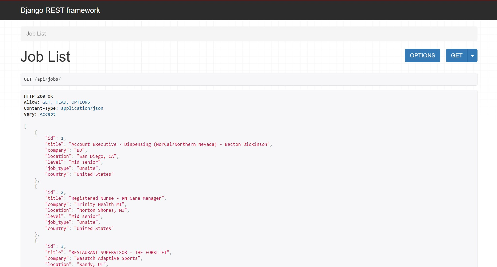

# 🚀 AI Job Market Intelligence Platform

<p align="center">
A full-stack analytics platform that explores job market trends using large-scale LinkedIn job data.
</p>

<p align="center">


</p>

---

# 📊 Project Overview

The **AI Job Market Intelligence Platform** is a full-stack data analytics application designed to analyze job market trends and visualize insights from a large dataset of LinkedIn job postings.

The platform processes **1.3M+ job postings** and provides an interactive dashboard where users can explore hiring trends, popular job roles, and geographic job distribution.

This project demonstrates **data engineering, backend API development, and frontend data visualization**.

---

# ✨ Features

✔ Skill-based job search  
✔ Interactive analytics dashboard  
✔ Top hiring companies visualization  
✔ Job type distribution  
✔ Location-based job insights  
✔ Global hiring map  
✔ Trending job role analysis  
✔ REST API backend  

---

# 📸 Dashboard Preview

## Main Dashboard


---

## Job Analytics Charts


---

## Global Hiring Map


---

## Skill Search Feature



# 🎥 Live Demo


# 🧠 System Architecture

```
LinkedIn Job Dataset
        ↓
Data Processing (Python + Pandas)
        ↓
Django REST API Backend
        ↓
React Analytics Dashboard
```

---

# 🛠 Tech Stack

## 🔹 Frontend
- React
- Material UI
- Recharts
- React Leaflet

## 🔹 Backend
- Django
- Django REST Framework

## 🔹 Data Processing
- Python
- Pandas

## 🔹 Dataset
- LinkedIn Job Postings Dataset

---

# 📂 Project Structure

```
ai-job-market-intelligence

backend
│
├── jobanalytics
│   └── Django project
│
├── jobs
│   └── API app
│
└── manage.py


frontend
│
└── job-dashboard
    └── src
        └── components


scripts
│
└── data processing scripts


data
│
└── processed datasets
```

---

# 📈 Dashboard Insights

The platform provides insights including:

📊 Top hiring companies  
📊 Job type distribution  
📊 Job location analysis  
📈 Trending job roles  
🌍 Global hiring map  

These visualizations help understand the **current job market landscape**.

---

# ⚙️ Installation & Setup

## Backend Setup

```bash
cd backend

python -m venv venv

venv\Scripts\activate

pip install django djangorestframework pandas

python manage.py migrate

python manage.py runserver
```

Backend runs at:

```
http://127.0.0.1:8000
```

---

## Frontend Setup

```bash
cd frontend/job-dashboard

npm install

npm start
```

Frontend runs at:

```
http://localhost:3000
```

---

# 🔎 Example API Endpoints

Get all jobs

```
http://127.0.0.1:8000/api/jobs/
```

Search by skill

```
http://127.0.0.1:8000/api/jobs/?skill=python
```

---

# 🚀 Future Improvements

- 🤖 AI chatbot for job market queries
- 🧠 LLM-based skill extraction
- 📈 Real-time job trend analytics
- 💰 Salary prediction model
- 🎯 Job recommendation system

---

# 👩‍💻 Author

**Mesa Sarah Vasantha Zephyr**

Computer Science Engineering Student  
Interested in Data Analytics, AI, and Full-Stack Development

---

# ⭐ Support

If you found this project useful, consider **starring the repository** ⭐

---

# 📜 License

This project is intended for educational and portfolio purposes.